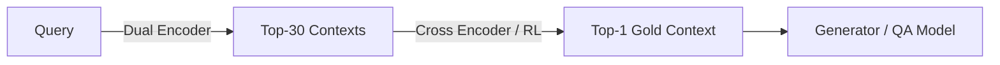

# AI 말평 대회 참여기 #7: 2주차(2) - Retrieval 설계와 데이터 구조 정리

이번 글은 2주차 두 번째 학습일지로, 이번주의 **회의 결과**를 정리한다.  
듀얼 인코더 학습 구현과 성능 평가는 다음 글에서 다룰 예정이다.

---

## 1. 팀 회의 결과 요약

사실 앞서 언급했지만 현재 Test set에는 정답이 존재하지 않기에 Retrieval이 사실상 불가능하다는 문제점이 존재한다.
그리고 Train set에 대해서는 질문에 대해 어떤 Context가 Gold인지 구하기에는 시간이 굉장히 오래 걸린다.
이를 해결하기 위해 우리 팀에서는 각각의 질문에 대해 **Context의 Perplexity 순위**를 구하고 이걸 **Gold**로 사용하기로 하였다.
이 아이디어를 기반으로 Retrieval 단계에서 30개 정도의 Context를 거르고 그 다음 강화학습을 통해 모델이 Gold를 찾아내게 학습시키는 것이우리의 전체 파이프라인 구조이다.

그리고 나는 Retrieval 단계에서 사용될 듀얼 인코더 학습용 Baseline 코드를 제작하는 역할을 맡게 되었다.
아직 부족한 실력이지만 최선을 다해 모르는 점은 공부하며 진행해보고자 한다.
상세 내용을 아래에 정리해보았다.


1. **Retrieval 단계**
   1. **Dual Encoder (Bi-Encoder)**
      - 142개 context → 30개로 1차 필터링
      - 빠른 Cosine Similarity / Dot Product 기반
   2. **Reinforcement Learning**
      - 30개 후보 중 **Gold Context**를 최종 선택해야함
      - 강화학습(RL)을 통해 Gold Context를 모델이 찾아내도록 학습

2. **나의 역할**
   - **Dual Encoder 학습 담당**
   - 1차 필터링 Recall@k 성능 확보가 목표


---

## 2. Retrieval 구조
Retrieval에서 사용되는 구조에 대해서 간단하게나마 정리해보았다.
자세하게 더 학습해야 할 내용들이 많아보여서 다음 글에서 자세하게 다뤄보려고 한다.  

### 2-1. Dual Encoder (Retriever)
- **구조**
  ```
  Query → Encoder_Q ┐
                     Dot Product → Similarity Score
  Context → Encoder_D ┘
  ```
- **특징**
  - Query와 Context를 **독립적으로 인코딩**
  - Embedding 간 유사도(Cosine/Dot Product)로 빠른 Top-k 검색
  - 장점: 빠른 검색, 대규모 데이터에 적합
  - 단점: Fine-grained reasoning 부족 → Reranker 필요

### 2-2. Cross Encoder (Re-Ranker)
- **구조**
  - Query와 Context를 하나의 입력 시퀀스로 결합
  - Transformer 기반으로 **문맥별 점수 계산**
- **특징**
  - 장점: 높은 정확도, 문맥 정합성 파악에 유리
  - 단점: 속도 느림 → Top-k 후보에만 사용



---

## 3. 사용 데이터 구조

이번 Retrieval 학습에는 **두 가지 주요 데이터셋**을 활용했다.
두 데이터셋 제작은 팀장님이 사전에 진행해주셨다.

### 3-1. GrammarBook (규범 문서)
- 대회 측 제공 어문 규범 문서를 파싱해 구조화한 데이터
- 각 규범은 다음과 같은 구조로 저장됨:

```json
{
  "category": "띄어쓰기",
  "source": "한글 맞춤법",
  "rule_id": "제2항",
  "title": "한글 맞춤법 제2항",
  "description": "<띄어쓰기 - 한글 맞춤법 제2항> 문장의 각 단어는 띄어 씀을 원칙으로 한다."
}
```

- Retrieval 시 **description**을 context로 활용

### 3-2. QA Dataset (Top-5 Context 후보)
- `qa_train.json` / `qa_eval.json` 구성
- 각 질문별로 **Top-5 Context 후보**를 수집
  - `kakaocorp/kanana-nano-2.1b-instruct` 모델로 **PPL(Perplexity)** 측정
  - PPL이 낮은 상위 5개 context 선택
- 데이터 예시:

```json
{
  "Question_ID": "686",
  "Question": "다음 문장에서 어문 규범에 부합하지 않는 부분을 찾아 고치고, 그 이유를 설명하세요.\n\"시간 제한이 있으니 서둘러.\"",
  "Answer": "\"시간제한이 있으니 서둘러.\"가 옳다. '일정한 시간 안에 어떠한 일을 하도록 제한하는 일'을 뜻하는 '시간제한'은 하나의 단어이다. 따라서 띄어 쓰지 않고 붙여 쓴다.",
  "baseline_ppl": 4.11,
  "Top-3_Lowest_context_PPL": [
    {
      "rank": 1,
      "rule_id": "제48항",
      "category": "띄어쓰기",
      "title": "한글 맞춤법 제48항",
      "description": "<띄어쓰기 - 한글 맞춤법 제48항> 성과 이름, 성과 호 등은 붙여 쓰고, 이에 덧붙는 호칭어, 관직명 등은 띄어 쓴다. 다만, 성과 이름, 성과 호를 분명히 구분할 필요가 있을 경우에는 띄어 쓸 수 있다.",
      "context_ppl": 3.75,
      "delta_ppl": 0.36,
      "improvement_ratio": 0.087
    },
    {
      "rank": 2,
      "rule_id": "제4장 제2절 제1항",
      "category": "외래어 표기법",
      "title": "외래어 표기법 제4장 제2절 제1항",
      "description": "<외래어 표기법 - 외래어 표기법 제4장 제2절 제1항> 중국 인명은 과거인과 현대인을 구분하여 과거인은 종전의 한자음대로 표기하고, 현대인은 원칙적으로 중국어 표기법에 따라 표기하되, 필요한 경우 한자를 병기한다.",
      "context_ppl": 3.77,
      "delta_ppl": 0.34,
      "improvement_ratio": 0.0828
    },
    {
      "rank": 3,
      "rule_id": "제38항",
      "category": "한글 맞춤법, 표준어 규정",
      "title": "한글 맞춤법 제38항",
      "description": "<한글 맞춤법, 표준어 규정 - 한글 맞춤법 제38항> ’ㅏ, ㅗ, ㅜ, ㅡ’ 뒤에 ’-이어’가 어울려 줄어질 적에는 준 대로 적는다.",
      "context_ppl": 3.81,
      "delta_ppl": 0.29,
      "improvement_ratio": 0.0716
    },
    {
      "rank": 4,
      "rule_id": "제36항",
      "category": "한글 맞춤법, 표준어 규정",
      "title": "한글 맞춤법 제36항",
      "description": "<한글 맞춤법, 표준어 규정 - 한글 맞춤법 제36항> ’ㅣ’ 뒤에 ’-어’가 와서 ’ㅕ’로 줄 적에는 준 대로 적는다.",
      "context_ppl": 3.82,
      "delta_ppl": 0.28,
      "improvement_ratio": 0.0691
    },
    {
      "rank": 5,
      "rule_id": "제3장 제6절 제1항",
      "category": "외래어 표기법",
      "title": "외래어 표기법 제3장 제6절 제1항",
      "description": "<외래어 표기법 - 외래어 표기법 제3장 제6절 제1항> 일본어의 표기에서, 촉음(促音) [ッ]는 ’ㅅ’으로 통일해서 적는다.",
      "context_ppl": 3.84,
      "delta_ppl": 0.27,
      "improvement_ratio": 0.0654
    }
  ]
}

```

> **Retrieval 학습 입력:**  
> `Question` + `Context(description)` 쌍

### 3-3. Perplexity (PPL) 활용
- **정의:** 언어모델이 해당 문장을 예측할 때의 불확실성  
- **공식:**

\[
PPL(W) = \exp\Big(-\frac{1}{N}\sum_{i=1}^{N}\log P(w_i | w_{<i})\Big)
\]

- **직관적 의미:**
  - PPL ↓ → 모델이 해당 문맥을 자연스럽게 이해 → 질문과 context 적합도 ↑  
  - PPL ↑ → 문맥이 어색하거나 불필요

- **이번 프로젝트 활용:**  
  - `kakaocorp/kanana-nano-2.1b-instruct` 모델로 Question+Context PPL 계산  
  - PPL Top-5 후보를 학습 데이터로 사용 → Gold 후보군 품질 향상


---

## 4. Loss 설계 아이디어

팀원분께서 Dual Encoder 학습은 **Gold 1개 + Negative 4개** 샘플링을 기반으로 **Cross Entropy Loss**를 통해 구현하면 될것이라고 조언해주셔서
일단 그 방향으로 학습 Baseline을 만들어보기로 하였다.

추가로 공부 도중 다음과 같은 Loss가 현재 내가 진행하려는 Task에서 많이 사용된다는 것을 알게 되어 추후에 이 Loss를 적용하는 것도 고려 해보기로 하였다.
이 두가지 Loss에 대한 개념을 정리해보면 아래와 같다.

### 4-1. CrossEntropy Loss

- **정의:** 정답 클래스의 log 확률을 최소화하는 손실  
- **공식:**

\[
\mathcal{L}_{CE} = - \frac{1}{N} \sum_{i=1}^{N} y_i \log \hat{y}_i
\]

- 이번 프로젝트에서는
  - Gold = 1, Negatives = 4
  - Softmax 후 CrossEntropy로 학습
  - Top-1 Gold Context를 맞추는 확률 극대화

### 4-2. Multiple Negatives Ranking Loss (MNR)

$$
\mathcal{L} = - \log \frac{ \exp(sim(q, c^+)) }{ \sum_{c \in \{c^+, c^-\}} \exp(sim(q, c)) }
$$

- **Positive:** Gold Context
- **Negative:** Batch 내 다른 context + Hard Negative
- **효과:**  
  - Batch 단위 contrastive 학습  
  - Retrieval 구분 능력 강화

---

## 5. 다음 계획

다음 글에서는 듀얼 인코더 심화 개념 (논문 기반 구조)와 학습 Baseline 코드 구현 그리고 Recall@k 기반 성능 평가에 대해서 다뤄보겠다.
아직 모르는게 너무나 많기 때문에 차근차근 배워가며 성장을 목표로 노력하고자 한다.
